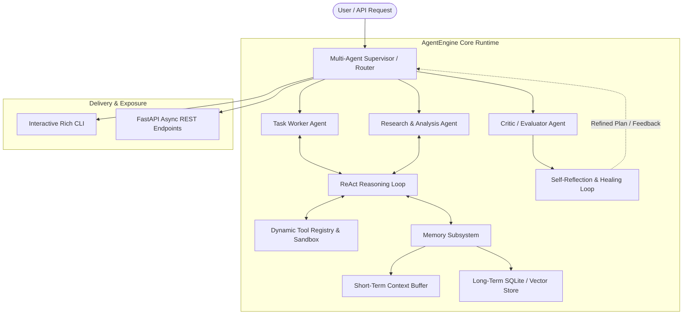

# 🧠 AgentEngine: Autonomous Multi-Agent Workflow Engine

> A modular, production-ready Multi-Agent AI System featuring dynamic tool calling, short/long-term memory persistence, self-reflection critic loops, and distributed agent collaboration.

[](LICENSE)
[](https://www.python.org/)
[](https://github.com/utkarshofficial999/Projects/actions)

---

## 📖 Project Overview

**AgentEngine** is a modern, extensible agentic framework built in Python to orchestrate autonomous, goal-directed AI agents. Unlike standard single-prompt LLM wrappers, AgentEngine provides an enterprise-ready architecture for multi-agent reasoning, dynamic tool execution, conversational and semantic vector memory, self-correcting critique loops, and dual interface capabilities (CLI & FastAPI).

---

## 🏛️ System Architecture



---

## ✨ Key Features

- 🔄 **ReAct Execution Engine**: Autonomous thought-action-observation cycles that reason step-by-step before answering.
- 🛠️ **Dynamic Tool Calling & Sandboxing**: Type-safe tool definitions using Pydantic schemas with automatic parameter validation and execution guardrails.
- 💾 **Dual-Tier Memory Management**:
  - **Short-Term Context Buffer**: Sliding window conversational memory preserving token budgets.
  - **Long-Term Vector / SQLite Store**: Persistent semantic search and state retrieval across sessions.
- 👥 **Multi-Agent Collaboration**:
  - Supervisor pattern orchestrating specialized worker agents.
  - Asynchronous message bus with structured agent handoffs.
- 🧐 **Self-Reflection & Error Healing**: Integrated critic agent that evaluates intermediate agent outputs and triggers self-correction loops when errors or hallucinations occur.
- 🌐 **Production Interfaces**: Out-of-the-box support for both an interactive terminal CLI (`agent-engine cli`) and a high-performance asynchronous FastAPI server.

---

## 📂 Repository Structure

```
├── agent_engine/               # Core AgentEngine Package
│   ├── __init__.py             # Package exports & version
│   ├── cli/                    # Interactive CLI runner
│   │   ├── __init__.py
│   │   └── main.py             # CLI commands and REPL
│   ├── core/                   # Architecture, config & logging
│   │   ├── __init__.py
│   │   ├── config.py           # Pydantic v2 settings & environment engine
│   │   └── logging.py          # Structured JSON/console logging with structlog
│   ├── agents/                 # Agent implementations & supervisor logic
│   ├── tools/                  # Dynamic tool registry & sandboxed tools
│   └── memory/                 # Short-term buffers and long-term vector state
├── tests/                      # Automated Pytest suite
├── docs/                       # Architecture specifications & tutorials
├── state/                      # Roadmap state & milestone tracking
│   └── roadmap.json
├── .github/workflows/          # 24/7 Autonomous Daily CI/CD Commit Workflow
│   └── daily_agent.yml
├── main.py                     # Agentic project engine runner
└── pyproject.toml              # Modern Python build & dependency specification
```

---

## 🗺️ Engineering Roadmap & Milestone Status

This project is iteratively constructed across **10 engineering milestones**, progressing continuously:

| # | Milestone | Phase | Status |
|:---:|---|---|:---:|
| **1** | **Repository Scaffolding, Package Setup & Core Config** | Architecture & Config | **✔ Completed** |
| **2** | **Pydantic Schemas, Message Protocols & Agent Abstractions** | Core Protocols | ⏳ In Progress |
| **3** | **ReAct Loop Implementation & Universal LLM Abstraction** | Execution Engine | ⏳ Upcoming |
| **4** | **Dynamic Tool Registry, Validation & Execution Sandbox** | Tool System | ⏳ Upcoming |
| **5** | **Short-Term Buffer & Long-Term Vector/SQLite Memory** | Context Management | ⏳ Upcoming |
| **6** | **Message Bus, Supervisor Pattern & Agent Handoffs** | Multi-Agent Systems | ⏳ Upcoming |
| **7** | **Reflection Loop, Critic Agent & Automatic Retry Logic** | Self-Reflection | ⏳ Upcoming |
| **8** | **FastAPI Server, Interactive CLI Interface & Demo Scripts** | Production Interface | ⏳ Upcoming |
| **9** | **Automated Pytest Suite for Core Logic, Tools & Memory** | Quality Assurance | ⏳ Upcoming |
| **10** | **Comprehensive Docs, Architecture Diagrams & Tutorials** | Release & Documentation | ⏳ Upcoming |

---

## ⚡ Quick Start & Installation

### 1. Prerequisites
- Python 3.10+
- Git

### 2. Installation
```bash
git clone https://github.com/utkarshofficial999/Projects.git
cd Projects
pip install -r requirements.txt
```

### 3. Running the CLI
```bash
python -m agent_engine.cli.main --help
```

---

## 🤖 Autonomous Daily Engineering System

This repository is powered by **GitAgentic**, an autonomous CI/CD software engineer that builds, verifies, and commits features every ~24 hours:

- **Automated Cloud Commits**: Handled by GitHub Actions ([`.github/workflows/daily_agent.yml`](.github/workflows/daily_agent.yml)).
- **Inspect Current Progress**:
  ```bash
  python main.py --status
  ```
- **Run the Local Background Daemon**:
  ```bash
  python main.py --start-daemon
  ```

---

## 📄 License
This project is open-source under the [MIT License](LICENSE).
